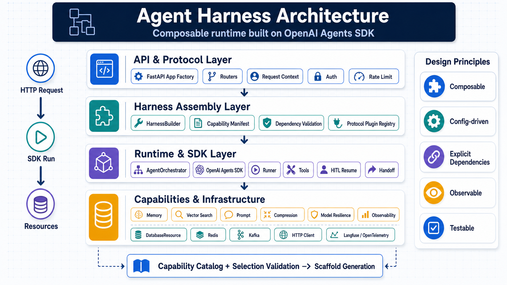
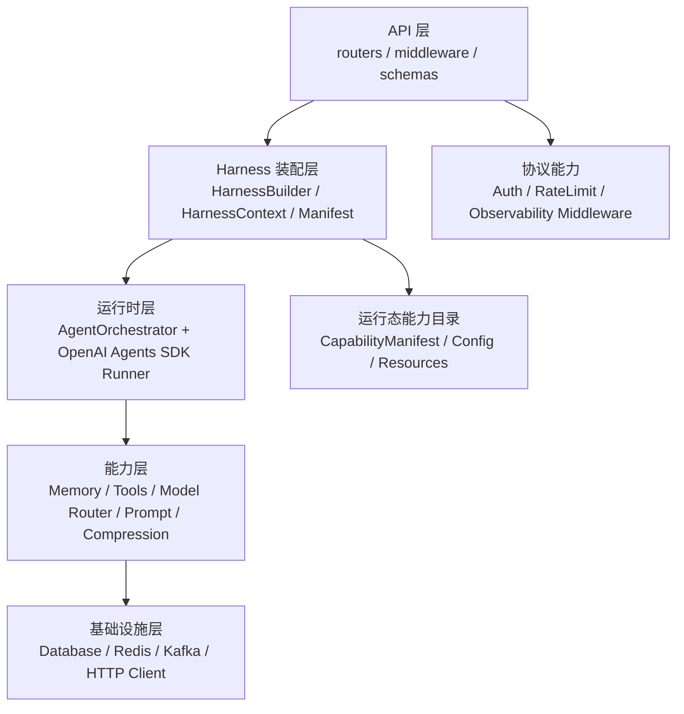
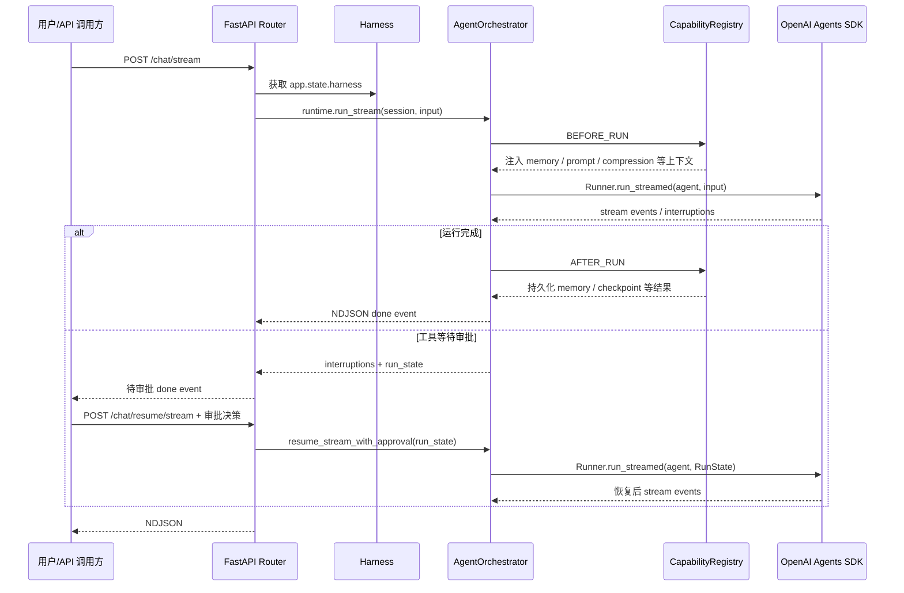

# 🚀 OpenAI Agents Harness - Agent Harness 工程底座

> 基于 OpenAI Agents SDK 的企业级 Agent Harness 工程底座。当前仓库提供除业务逻辑外的通用工程能力，业务方 fork 后自行实现业务 Agent、业务工具和业务流程。

## 🎯 项目定位

本项目不是具体业务 Agent，也不负责根据能力选择自动生成业务代码。它是一个具备完整通用能力的 Agent Harness 工程底座，多个业务方可以 fork 后在其上开发自己的业务逻辑。

业务方 fork 后通常只需要：

- 添加自己的业务工具、业务 Agent instructions、业务 API 或 UI。
- 根据业务需要调整 `AgentFactory` 或 Runtime 编排。
- 通过 `config/*.env` 中的能力开关选择是否启用 Memory、HITL、Handoff、Observability、Auth、RateLimit 等能力。

核心特性：

- ✅ **统一装配**：`HarnessBuilder` 负责组装运行时、资源、注册中心和能力模块。
- ✅ **能力声明**：`CapabilityManifest` 描述能力名称、类型、依赖、产物、安装顺序和标签。
- ✅ **边界清晰**：API 层只依赖 Harness，不直接感知能力组合和具体后端。
- ✅ **显式依赖**：`Runtime` 通过依赖注入使用 `Tool`、`Model Router`、`Memory`、`Prompt` 等能力。
- ✅ **能力完整**：内置常见 Agent 工程能力，业务方按 env 开关启用。
- ✅ **SDK 原生路径**：主执行链路基于 OpenAI Agents SDK 的 `Agent`、`Runner`、`function_tool`。

## 🧭 架构总览






核心原则：

- **轻量化**：默认关闭可选能力，未启用能力不进入运行路径。
- **可插拔**：能力通过统一接口和 manifest 接入，避免散落的硬编码判断。
- **可配置**：通过 env 文件选择启用所需能力，不内置业务逻辑。
- **可测试**：单元、集成、端到端测试分层，默认测试不依赖外部服务。
- **可维护**：`API`、`Runtime`、`Capability`、`Infrastructure` 边界清晰。

当前 `CapabilityManifest` 用于描述能力目录、依赖和装配顺序；运行时装配由 `HarnessBuilder` 和 `AgentOrchestrator` 显式实现。

## 🧰 可插拔能力

下表列出 Harness 内置的通用能力。业务方 fork 后通过 env 开关启用需要的能力，并在这些能力之上实现自己的业务逻辑。

| 能力域 | 能力项 | 类型 / 状态 | 技术选型 | 当前技术实现方案 | 装配入口 |
| --- | --- | --- | --- | --- | --- |
| 工具执行 | `tool_registry` | runtime / 已实现，基础必选 | OpenAI Agents SDK `function_tool` | `ToolRegistry` 注册工具元数据并转换为 SDK Tool；审批策略可附加到工具定义 | Harness 默认创建 |
| 模型访问 | `model_router` | runtime / 已实现，基础必选 | OpenAI Agents SDK + OpenAI-compatible API | `ModelRouter` 按任务选择默认或推理模型，并由 `AgentOrchestrator` 调用 SDK `Runner` | Harness 默认创建 |
| 模型稳定性 | `model_resilience` | runtime / 部分实现 | 自研 Retry / Timeout / Fallback | 按弹性配置构建 runner 包装与 fallback 模型链，隔离模型调用故障 | `MODEL_RESILIENCE_ENABLED` |
| 会话记录 | `session_store` | resource / 已实现 | MySQL/PostgreSQL + SQLAlchemy Async | 持久化用户会话、完整消息流水和后续事件扩展，供 UI 历史会话与审计使用 | `SESSION_STORE_ENABLED` |
| 会话记忆 | `memory_session` | runtime / 已实现 | Redis ShortTermMemory + session_store 回源 | 在 Agent 执行前后读取当前会话最近上下文；Redis 承载短期缓存，Redis 未启用或 miss 时读取会话存储最近消息，不使用进程内兜底 | `MEMORY_SHORT_TERM_ENABLED` |
| 会话摘要 | `session_summary` | runtime / 已实现 | LLM Summary + session_store + Redis Cache | `after_run` 后台滚动生成摘要，会话存储持久化、Redis 可缓存；当前轮消息可直接触发 summary，不依赖路由层先落库 | `MEMORY_SESSION_SUMMARY_ENABLED` |
| 长期记忆 | `long_term_memory` | runtime / 已实现 | Mem0 | 由 Mem0 负责用户偏好与长期记忆抽取、写入和搜索；删除会话不会删除长期记忆，用户级长期记忆需显式清理 | `MEMORY_LONG_TERM_ENABLED` |
| 长期记忆资源 | `memory_manager` | resource / 已实现，依赖自动引入 | Mem0 SDK | 持有 Mem0 适配器和 Redis 短期会话缓存；长期向量存储可选 Mem0 默认、pgvector 或 Elasticsearch；读取偏好时同一维度只注入最新生效项；提供显式用户级清理接口 | 启用长期记忆时自动装配 |
| 语义召回 | `vector_search` | runtime / 已实现 | Mem0 Search + pgvector/ES 可选 | 由 Mem0 搜索返回偏好和长期记忆；偏好类查询会做冲突消解；向量后端通过 `MEMORY_LONG_TERM_VECTOR_STORE` 选择 | `MEMORY_LONG_TERM_ENABLED` |
| Prompt 管理 | `prompt` | runtime / 已实现 | Langfuse Prompt + Local YAML | `PromptManager` 负责拉取、TTL 缓存与渲染；`CompositeStore` 支持远端失败时本地降级 | `PROMPT_ENABLED` |
| 上下文治理 | `context_compression` | runtime / 已实现 | tiktoken + 可配置 LLM Summary | 提供 token budget 截断、rolling summary 与 hybrid 策略，在执行前压缩上下文 | `COMPRESSION_ENABLED` |
| 人工审批 | `hitl` | runtime / 部分实现 | OpenAI Agents SDK 原生 HITL | 工具标记 `needs_approval` 触发中断；`/chat/resume/stream` 处理同意或拒绝 | `HITL_ENABLED` |
| 状态快照 | `checkpoint` | runtime / 部分实现 | 进程内 Checkpoint Manager | 保存执行摘要与状态展示信息，当前不等同于持久化 SDK `RunState` | `CHECKPOINT_ENABLED` |
| Agent 协作 | `handoff` | runtime / 部分实现 | OpenAI Agents SDK 原生 Handoff | 按配置构建目标 Agent，并注入主 Agent 的 `handoffs` 列表完成专家转交 | `HANDOFF_ENABLED` |
| 身份认证 | `auth` | protocol / 已实现 | PyJWT | `AuthPlugin` 在 HTTP 请求链解析 JWT，并写入 `request.state.principal` | `AUTH_ENABLED` |
| 用户限流 | `rate_limit` | protocol / 已实现 | Token Bucket + Redis / Memory backend | `RateLimitPlugin` 默认使用 Auth 产生的 principal 作为限流键；可显式选择 IP 兼容策略 | `RATE_LIMIT_ENABLED` |
| 可观测性 | `observability` | resource + protocol adapter / 已实现 | Langfuse + OpenTelemetry + OpenInference | `ObservabilityCapability` 由 Harness 管理 tracer 生命周期；HTTP plugin 只贡献请求 span 入口 | `LANGFUSE_ENABLED` |

装配边界：

- `runtime` 能力进入 Agent 执行过程，由 `HarnessBuilder` 创建资源并注入 `AgentOrchestrator`。
- `protocol` 能力进入 HTTP 请求链，当前显式顺序为 `RequestContext -> Auth -> RateLimit`。
- `governance` 能力由 Harness 负责初始化与释放。

## 🧩 能力体系

能力由 `CapabilityManifest` 描述：

```python
CapabilityManifest(
    name="context_compression",
    kind=CapabilityKind.RUNTIME,
    config_section="compression",
    depends_on=("model_router", "conversation_context"),
    provides=("compressed_context",),
    install_order=30,
)
```

能力类型：

| 类型           | 说明 | 示例 |
|--------------| --- | --- |
| `runtime`    | 参与 Agent 执行生命周期 | `Memory`、`Prompt`、`Compression`、`Model Router` |
| `protocol`   | 参与 HTTP 请求生命周期 | Auth、RateLimit |
| `governance` | 平台治理、策略、审计、评估 | Observability |

当前能力状态：

| 能力 | 类型 | 状态 | 说明 |
| --- | --- | --- | --- |
| `tool_registry` | runtime | ✅ 已实现 | 工具注册、元数据、OpenAI Agents SDK 工具适配 |
| `model_router` | runtime | ✅ 已实现 | 模型选择、任务类型推断 |
| `model_resilience` | runtime | 🟡 部分实现 | 降级、重试、超时 runner 已具备 |
| `memory_session` | runtime | ✅ 已实现 | 短期会话记忆 |
| `long_term_memory` | runtime | ✅ 已实现 | Mem0 后端已接入 |
| `vector_search` | runtime | ✅ 已实现 | Mem0 Search |
| `prompt` | runtime | ✅ 已实现 | Harness 构建 PromptManager，并注入 Runtime |
| `context_compression` | runtime | ✅ 已实现 | 支持 token budget、rolling summary、hybrid |
| `auth` | protocol | ✅ 已实现 | JWT 中间件插件 |
| `rate_limit` | protocol | ✅ 已实现 | Redis/内存限流中间件插件 |
| `observability` | governance | ✅ 已实现 | Langfuse/OpenTelemetry 生命周期，并向 HTTP 链路贡献追踪入口 |
| `hitl` | runtime | 🟡 部分实现 | 配置驱动装配，已接入 SDK 原生中断与 `POST /chat/resume/stream` |
| `checkpoint` | runtime | 🟡 部分实现 | 配置驱动的进程内执行快照，不等同于 SDK `RunState` 存储 |
| `handoff` | runtime | 🟡 部分实现 | 配置驱动装配，主 Agent 已接入 SDK 原生 `handoffs` |

## 🏗️ 当前目录结构

```text
src/
├── api/
│   ├── app.py               # FastAPI app factory 与接入层装配
│   ├── middleware/          # ProtocolPlugin、Auth / RateLimit / 请求上下文
│   ├── routers/             # HTTP 路由：chat / health / memory
│   └── schemas/             # API 请求/响应模型
├── application/
│   └── orchestration/       # AgentOrchestrator 运行时编排
├── capabilities/
│   ├── advanced_agents/     # HITL / Checkpoint / Handoff
│   ├── context_compression/ # 上下文压缩
│   ├── memory/              # 短期记忆、长期记忆、向量检索
│   ├── model_routing/       # 模型路由、降级、重试、超时
│   ├── observability/       # Langfuse / OpenTelemetry
│   ├── plugin/              # Capability 协议、Registry、RunContext
│   ├── prompt/              # PromptManager 和 PromptStore
│   └── tools/               # ToolRegistry 和工具定义
├── core/                    # 配置、日志、ID、解析工具
├── harness/                 # HarnessBuilder / Context / Manifest / FastAPI deps
├── infrastructure/          # DB / Redis / Kafka / HTTP Client
├── utils/
└── main.py                  # 仅导出 ASGI app

tests/
├── unit/                    # 快速单元测试
├── integration/             # 本地集成测试
└── e2e/                     # 端到端/外部服务测试

docs/
├── design/                  # 当前架构与历史设计记录
└── usage/                   # 当前能力使用指南

examples/
├── README.md                # 示例入口与运行条件
└── *.py                     # 能力与集成示例
```

## 📦 依赖及版本要求

本地安装以 `requirements.txt` 为准，包元数据和开发依赖在 `pyproject.toml` 中维护。`make install` 会先安装运行依赖，再以 editable 模式安装当前工程。

基础运行环境：

| 依赖 | 版本要求 | 用途 |
| --- | --- | --- |
| Python | `>=3.11` | 运行 FastAPI、OpenAI Agents SDK 和异步资源 |
| pip / venv | 随 Python 3.11+ 提供 | 本地虚拟环境与依赖安装 |
| OpenAI-compatible API | 需兼容 OpenAI Chat/Responses 能力 | Agent 模型调用、摘要、embedding |

核心 Python 依赖：

| 依赖 | 当前要求 | 用途 |
| --- | --- | --- |
| `openai-agents` | `>=0.8.0` | Agent、Runner、HITL、Handoff 等 SDK 原生能力 |
| `openai` | `>=2.26.0` | OpenAI / 兼容网关客户端 |
| `fastapi` | `~=0.116.0` | HTTP API |
| `uvicorn` | `~=0.35.0` | ASGI 服务 |
| `pydantic` | `~=2.12.2` | API 与配置数据模型 |
| `sqlalchemy` | `~=2.0.36` | 会话存储、数据库连接池 |
| `httpx` | `~=0.27.0` | 通用异步 HTTP 客户端 |
| `python-dotenv` | `~=1.0.0` | 加载 `config/{ENVTYPE}.env` |

可选能力依赖会随 `requirements.txt` 一起安装，但只有启用对应配置后才进入运行路径：

| 能力域 | Python 依赖 | 外部资源 |
| --- | --- | --- |
| 会话存储 | `aiomysql~=0.2.0` | MySQL 兼容数据库 |
| PostgreSQL / pgvector | `asyncpg>=0.29.0`、`psycopg[binary,pool]>=3.2.0` | PostgreSQL 与 pgvector 扩展 |
| Redis 缓存 / 限流 | `redis[hiredis]>=5.0.0` | Redis |
| 长期记忆 | `mem0ai>=0.1.0` | Mem0 local 或 Mem0 Platform |
| Elasticsearch 向量后端 | `elasticsearch>=8.0.0` | Elasticsearch |
| 上下文压缩 | `tiktoken>=0.7.0` | 无额外服务，摘要策略会调用模型 |
| Prompt 本地后端 | `PyYAML>=6.0` | 本地 YAML 文件 |
| 可观测性 | `langfuse>=2.50.0`、`openinference-instrumentation-openai-agents>=0.1.0`、`opentelemetry-*>=1.27.0` | Langfuse / OTLP endpoint |
| Kafka 集成 | `aiokafka~=0.11.0` | Kafka，可选 |
| 协议认证 | `PyJWT>=2.8.0` | JWT issuer / key，可选 |

开发与测试依赖：

| 依赖 | 版本要求 | 用途 |
| --- | --- | --- |
| `pytest` | `>=8.0.0` | 单元、集成、E2E 测试 |
| `pytest-asyncio` | `>=0.23.0` | 异步测试 |
| `pytest-cov` | `>=5.0.0` | 覆盖率 |
| `ruff` | `>=0.3.0` | lint、自动修复和格式化 |
| `mypy` | `>=1.8.0` | 类型检查 |

## 🔄 请求运行流程



## 🚀 快速开始

### 1. 准备环境

```bash
python3.11 -m venv venv
source venv/bin/activate
make install
```

### 2. 配置环境变量

```bash
cp config/test.env.example config/test.env
```

最小聊天能力需要：

```bash
OPENAI_API_KEY=your-api-key
AGENT_MODEL_DEFAULT=qwen3.5-plus
```

数据库、Redis、pgvector、Elasticsearch 都是可选外部依赖：可以直接配置公司或云上的实例，也可以用本仓库的 Docker Compose 在本地启动一套开发依赖。

使用已有外部依赖时，在 `config/test.env` 中填写对应地址即可：

```bash
SESSION_STORE_ENABLED=true
SESSION_STORE_DATABASE_SCHEME=mysql+aiomysql
SESSION_STORE_DATABASE_HOST=mysql.example.com
SESSION_STORE_DATABASE_PORT=3306
SESSION_STORE_DATABASE_NAME=agent_harness
SESSION_STORE_DATABASE_USER=agent
SESSION_STORE_DATABASE_PASSWORD=agent_pass

REDIS_ENABLED=true
REDIS_URL=redis://redis.example.com:6379/0

MEMORY_LONG_TERM_ENABLED=true
MEMORY_LONG_TERM_VECTOR_STORE=pgvector
MEMORY_PGVECTOR_PGHOST=pgvector.example.com
MEMORY_PGVECTOR_PGPORT=5432
MEMORY_PGVECTOR_PGDATABASE=agent_memory
MEMORY_PGVECTOR_PGUSER=agent
MEMORY_PGVECTOR_PGPASSWORD=agent_pass
```

本地 Docker 快速启动依赖：

```bash
# 启动 MySQL、Redis、pgvector；常规会话存储和长期记忆足够使用
docker compose -f docker-compose.storage.yml up -d mysql redis pgvector

# 如果长期记忆向量后端选择 Elasticsearch，再额外启动 ES
docker compose -f docker-compose.storage.yml up -d elasticsearch

# 查看健康状态
docker compose -f docker-compose.storage.yml ps
```

本地 Docker 默认连接信息：

| 服务 | 本地地址 | 账号 / 库 |
| --- | --- | --- |
| MySQL | `127.0.0.1:13306` | `agent` / `agent_pass`，数据库 `agent_harness` |
| Redis | `127.0.0.1:6379` | 无密码，DB `0` |
| pgvector | `127.0.0.1:15432` | `agent` / `agent_pass`，数据库 `agent_memory` |
| Elasticsearch | `http://127.0.0.1:9200` | 关闭安全认证，仅本地开发 |

对应 `config/test.env` 可直接使用：

```bash
SESSION_STORE_ENABLED=true
SESSION_STORE_DATABASE_SCHEME=mysql+aiomysql
SESSION_STORE_DATABASE_HOST=127.0.0.1
SESSION_STORE_DATABASE_PORT=13306
SESSION_STORE_DATABASE_NAME=agent_harness
SESSION_STORE_DATABASE_USER=agent
SESSION_STORE_DATABASE_PASSWORD=agent_pass

REDIS_ENABLED=true
REDIS_URL=redis://127.0.0.1:6379/0

MEMORY_SHORT_TERM_ENABLED=true
MEMORY_SESSION_SUMMARY_ENABLED=true
MEMORY_LONG_TERM_ENABLED=true
MEMORY_LONG_TERM_PROVIDER=mem0
MEMORY_LONG_TERM_MEM0_MODE=local
MEMORY_LONG_TERM_VECTOR_STORE=pgvector
MEMORY_PGVECTOR_PGHOST=127.0.0.1
MEMORY_PGVECTOR_PGPORT=15432
MEMORY_PGVECTOR_PGDATABASE=agent_memory
MEMORY_PGVECTOR_PGUSER=agent
MEMORY_PGVECTOR_PGPASSWORD=agent_pass
MEMORY_PGVECTOR_TABLE=agent_memories
```

如果只想验证最小聊天链路，可以先不启用 `SESSION_STORE_ENABLED`、`MEMORY_SHORT_TERM_ENABLED`、`MEMORY_SESSION_SUMMARY_ENABLED` 和 `MEMORY_LONG_TERM_ENABLED`，这样不依赖本地数据库或 Redis。

### 3. 启动服务

```bash
make run
curl http://localhost:8080/health/ok
```

### 4. 运行测试

```bash
make dev
make format
make test
make test-all
```

开发代码后建议先执行 `make format`，它会运行 `ruff check --fix src/ tests/` 和 `ruff format src/ tests/`，再运行对应测试。

当前本地测试状态：

```text
make test      -> 74 passed
make test-all  -> 146 passed, 10 skipped
```

依赖外部模型服务的 E2E 测试默认跳过；`tests/e2e/test_langfuse.py` 当前会随全量测试执行。如需显式运行外部模型用例：

```bash
RUN_EXTERNAL_TESTS=true make test-all
```

## ⚙️ 常用配置开关

配置从 `config/{ENVTYPE}.env` 加载；本地默认 `ENVTYPE=test`，生产示例见 `config/prod.env.example`。下面按能力域拆分，每个域内列出可独立启用的原子能力。

### 基础运行与资源

应用基础：

```bash
ENVTYPE=test
APP_PROFILE=test
DEBUG=true
HOST=0.0.0.0
PORT=8080
LOG_LEVEL=INFO
```

通用 HTTP Client：

```bash
HTTP_TIMEOUT_SECONDS=30
HTTP_CONNECT_TIMEOUT_SECONDS=10
HTTP_READ_TIMEOUT_SECONDS=20
HTTP_WRITE_TIMEOUT_SECONDS=10
HTTP_MAX_CONNECTIONS=100
HTTP_MAX_KEEPALIVE_CONNECTIONS=20
HTTP_KEEPALIVE_EXPIRY_SECONDS=30
HTTP_FOLLOW_REDIRECTS=true
HTTP_VERIFY_TLS=true
```

会话存储数据库：

```bash
SESSION_STORE_DATABASE_SCHEME=mysql+aiomysql
SESSION_STORE_DATABASE_HOST=localhost
SESSION_STORE_DATABASE_PORT=3306
SESSION_STORE_DATABASE_NAME=agent
SESSION_STORE_DATABASE_USER=agent
SESSION_STORE_DATABASE_PASSWORD=secret
SESSION_STORE_DATABASE_SSLMODE=
SESSION_STORE_DATABASE_POOL_SIZE=10
SESSION_STORE_DATABASE_MAX_OVERFLOW=20
SESSION_STORE_DATABASE_POOL_TIMEOUT_SECONDS=30
SESSION_STORE_DATABASE_POOL_RECYCLE_SECONDS=1800
SESSION_STORE_DATABASE_POOL_PRE_PING=true
```

会话存储数据库统一使用拆分字段配置，服务启动时会自动组装 SQLAlchemy URL；密码里包含 `%`、`@`、`!` 等特殊字符时也可以直接写原始值。MySQL 使用 `SESSION_STORE_DATABASE_SCHEME=mysql+aiomysql`，PostgreSQL 使用 `SESSION_STORE_DATABASE_SCHEME=postgresql+asyncpg`，并按需设置 `SESSION_STORE_DATABASE_PORT=5432`、`SESSION_STORE_DATABASE_SSLMODE=require`。

PostgreSQL 会话存储示例：

```bash
SESSION_STORE_DATABASE_SCHEME=postgresql+asyncpg
SESSION_STORE_DATABASE_HOST=pg.example.com
SESSION_STORE_DATABASE_PORT=5432
SESSION_STORE_DATABASE_NAME=agent_harness
SESSION_STORE_DATABASE_USER=agent
SESSION_STORE_DATABASE_PASSWORD=secret@pg!
SESSION_STORE_DATABASE_SSLMODE=require
```

Redis：

```bash
REDIS_ENABLED=false
REDIS_URL=redis://localhost:6379/0
REDIS_SLAVE_URL=
```

通用 HTTP Client 懒加载，不会因未被能力或工具使用而在启动阶段创建连接。数据库由 Harness 统一持有共享连接池，Memory 不再建立独立 pool。

### 模型与推理

模型访问：

```bash
OPENAI_API_KEY=your-api-key
OPENAI_BASE_URL=
AGENT_MODEL_DEFAULT=gpt-4o-mini
AGENT_MODEL_REASONING=gpt-4.1-mini
```

模型弹性：

```bash
MODEL_RESILIENCE_ENABLED=false
MODEL_FALLBACK_ENABLED=false
MODEL_FALLBACK_CHAIN=gpt-4.1-mini,gpt-4o-mini
MODEL_RETRY_ENABLED=false
MODEL_MAX_RETRIES=2
MODEL_RETRY_DELAY=1.0
MODEL_RETRY_MAX_DELAY=10.0
MODEL_TIMEOUT_ENABLED=false
MODEL_TOTAL_TIMEOUT=30.0
MODEL_PER_REQUEST_TIMEOUT=10.0
```

推理摘要：

```bash
REASONING_SUMMARY_ENABLED=false
REASONING_SUMMARY_MODE=auto
```

开启后会向 Agents SDK 传入 `ModelSettings(reasoning=Reasoning(summary=...))`。是否产生“推理摘要”流式事件取决于模型和 SDK 路径支持情况。

### 记忆管理

会话存储：

```bash
SESSION_STORE_ENABLED=false
SESSION_STORE_AUTO_CREATE=true
SESSION_STORE_DATABASE_SCHEME=mysql+aiomysql
SESSION_STORE_DATABASE_HOST=localhost
SESSION_STORE_DATABASE_PORT=3306
SESSION_STORE_DATABASE_NAME=agent
SESSION_STORE_DATABASE_USER=agent
SESSION_STORE_DATABASE_PASSWORD=secret
```

`session_store` 保存会话列表、完整消息流水和会话 summary，是 UI 回放、审计和 Redis miss 回源的权威存储。

短期记忆：

```bash
MEMORY_SHORT_TERM_ENABLED=false
MEMORY_SHORT_TERM_TTL=3600
MEMORY_SHORT_TERM_CONTEXT_MAX_TURNS=6
REDIS_ENABLED=true
REDIS_URL=redis://localhost:6379/0
```

短期记忆用 Redis 缓存当前会话最近上下文；Redis 未启用或 miss 时会回源 MySQL 最近消息。

短期 summary：

```bash
MEMORY_SESSION_SUMMARY_ENABLED=true
MEMORY_SESSION_SUMMARY_CACHE_TTL=2592000
MEMORY_SESSION_SUMMARY_INITIAL_MESSAGES=4
MEMORY_SESSION_SUMMARY_UPDATE_MESSAGES=6
MEMORY_SESSION_SUMMARY_MODEL=
MEMORY_SESSION_SUMMARY_MAX_TOKENS=512
MEMORY_SESSION_SUMMARY_MAX_SOURCE_MESSAGES=20
```

summary 在 `after_run` 后台滚动生成，MySQL 持久化、Redis 可缓存；summary 更新会携带当前轮 user/assistant 消息。

长期记忆：

```bash
MEMORY_LONG_TERM_ENABLED=false
MEMORY_LONG_TERM_PROVIDER=mem0
MEMORY_LONG_TERM_MEM0_MODE=local
MEMORY_LONG_TERM_MEM0_API_KEY=
MEMORY_LONG_TERM_MEM0_CONFIG_JSON=
MEMORY_PREFERENCE_CACHE_TTL_SEC=900
MEMORY_EMBEDDING_MODEL=text-embedding-3-small
MEMORY_VECTOR_DIMENSION=1536
MEMORY_LONG_TERM_CONTEXT_MAX_MEMORIES=3
```

Mem0 统一管理用户偏好、长期事实和语义召回；长期记忆是用户级资产，默认不随会话删除。Mem0 local 模式默认复用主模型配置：`llm.config` 使用 `OPENAI_API_KEY`、`OPENAI_BASE_URL` 和 `AGENT_MODEL_DEFAULT`；`embedder.config` 使用 `OPENAI_API_KEY`、`OPENAI_BASE_URL` 和 `MEMORY_EMBEDDING_MODEL`。使用 Mem0 Platform 时，将 `MEMORY_LONG_TERM_MEM0_MODE=platform` 并配置 `MEMORY_LONG_TERM_MEM0_API_KEY`。

长期记忆向量后端：

```bash
MEMORY_LONG_TERM_VECTOR_STORE=none
MEMORY_PGVECTOR_PGHOST=
MEMORY_PGVECTOR_PGPORT=5432
MEMORY_PGVECTOR_PGDATABASE=
MEMORY_PGVECTOR_PGUSER=
MEMORY_PGVECTOR_PGPASSWORD=
MEMORY_PGVECTOR_PGSSLMODE=
MEMORY_PGVECTOR_TABLE=agent_memories
MEMORY_ES_HOSTS=http://localhost:9200
MEMORY_ES_INDEX=agent_memories
```

`MEMORY_LONG_TERM_VECTOR_STORE=pgvector` 时配置 `MEMORY_PGVECTOR_*`；`MEMORY_LONG_TERM_VECTOR_STORE=elasticsearch` 时配置 `MEMORY_ES_HOSTS` 和 `MEMORY_ES_INDEX`。pgvector 密码可直接写原始特殊字符，代码内部会做 URL 编码。

运行时读取链路：`before_run` 读取用户偏好、相关长期记忆、已有会话 summary 和最近会话消息，并装配到输入上下文；它不会同步重建 summary，避免请求链路被历史消息读取和 LLM 摘要阻塞。

运行时写入链路：`after_run` 写 Redis 短期原文缓存，后台更新会话 summary，并把通过噪声过滤的 user/assistant 对话提交给 Mem0。Mem0 自行判断是否抽取、合并、更新或忽略长期记忆。

偏好记忆采用“保留历史、注入生效版本”的策略：写入时把 user 输入提交给 Mem0，由 Mem0 判断是否抽取为用户偏好或其他长期记忆；检索或注入上下文时，业务层再对偏好类结果做轻量冲突消解，同一偏好维度只保留最新一条。这样既不破坏 Mem0 中的历史记忆，又避免冲突偏好同时进入 prompt。

记忆清理边界：

- `DELETE /chat/sessions/{session_id}` 删除 MySQL 会话、消息、会话 summary，并清理该 session 的 Redis 短期记忆；它不会删除 Mem0 长期记忆。
- `POST /memory/clear` 只清理指定 session 的短期记忆。
- `POST /memory/clear-user` 显式清理指定用户的 Mem0 长期记忆，例如 `{"user_id":"ui-tester"}`。

### Prompt 管理

```bash
PROMPT_ENABLED=false
PROMPT_BACKEND=composite
PROMPT_LOCAL_DIR=prompts
PROMPT_DEFAULT_LABEL=prod
PROMPT_CACHE_TTL_SEC=300
PROMPT_WARMUP_NAMES=
PROMPT_FAIL_OPEN=true
```

`composite` 后端表示优先使用 Langfuse Prompt，失败时回退到本地 YAML。`PROMPT_FAIL_OPEN=true` 时，Prompt 获取失败会降级到 Runtime 默认指令。

### 上下文治理

```bash
COMPRESSION_ENABLED=false
COMPRESSION_STRATEGY=token_budget
COMPRESSION_SAFETY_RATIO=0.9
COMPRESSION_KEEP_RECENT_TURNS=4
COMPRESSION_SUMMARY_MODEL=
COMPRESSION_SUMMARY_MAX_TOKENS=512
COMPRESSION_CACHE_TTL_SEC=3600
COMPRESSION_FAIL_OPEN=true
```

支持 `token_budget`、`rolling_summary` 和 `hybrid`。开启摘要策略时会调用模型，`COMPRESSION_SUMMARY_MODEL` 为空则复用默认模型。

### Advanced Agents

HITL 原生工具审批：

```bash
HITL_ENABLED=false
HITL_APPROVAL_TIMEOUT=300
HITL_REQUIRE_APPROVAL_TOOLS=get_weather
HITL_AUTO_APPROVE_TOOLS=
```

启用后，命中配置工具的 `/chat/stream` 的 `done` 事件会包含 `input`、`model`、`interruptions` 与 `run_state`。人工决策通过 `POST /chat/resume/stream` 恢复执行，需原样回传 `message=input`、`model` 和 `run_state`；已装配 HITL manager 时，还必须携带 `interruptions[].id` 作为 `approval_request_id`。

Checkpoint 执行快照：

```bash
CHECKPOINT_ENABLED=false
CHECKPOINT_MAX_CHECKPOINTS=10
CHECKPOINT_AUTO_SAVE=true
```

`Checkpoint` 当前仅在进程内记录 Agent 执行的运行前/运行后摘要，用于调试与业务状态回看；它不保存 OpenAI Agents SDK 的 `RunState`，不能用于服务重启后的 HITL 恢复。

Handoff 专家转交：

```bash
HANDOFF_ENABLED=false
HANDOFF_AGENTS_JSON={"billing":{"description":"处理账单问题","instructions":"只处理账单相关请求。"}}
```

启用后，`HarnessBuilder` 装配静态专家 Agent，Runtime 将其作为 SDK 原生 `Agent.handoffs` 传入主 Agent。当前仅支持专家描述与指令，不包含专家专属工具集或动态路由规则。

### 协议安全

JWT 认证：

```bash
AUTH_ENABLED=false
AUTH_STRICT=false
AUTH_JWT_ALGORITHM=HS256
AUTH_JWT_SECRET=
AUTH_JWT_PUBLIC_KEY=
AUTH_JWT_ISSUER=
AUTH_JWT_AUDIENCE=
AUTH_JWT_LEEWAY_SEC=30
AUTH_SKIP_PATHS=/health,/docs,/redoc,/openapi.json,/ui
```

限流：

```bash
RATE_LIMIT_ENABLED=false
RATE_LIMIT_BACKEND=redis
RATE_LIMIT_DEFAULT_LIMIT=60
RATE_LIMIT_DEFAULT_WINDOW_SEC=60
RATE_LIMIT_DEFAULT_BURST=10
RATE_LIMIT_KEY_STRATEGY=principal
RATE_LIMIT_FAIL_OPEN=false
RATE_LIMIT_ROUTES=
RATE_LIMIT_SKIP_PATHS=/health,/docs,/redoc,/openapi.json,/ui
```

使用 Redis 限流时必须同时启用 Redis；限流启动探活或请求阶段后端失败默认阻止服务/返回 `503`，仅在显式设置 `RATE_LIMIT_FAIL_OPEN=true` 时降级放行。

### 可观测性

```bash
LANGFUSE_ENABLED=false
LANGFUSE_PUBLIC_KEY=
LANGFUSE_SECRET_KEY=
LANGFUSE_BASE_URL=http://agent-otel-test.ke.com
LANGFUSE_TRACING_ENABLED=true
LANGFUSE_METRICS_ENABLED=true
LANGFUSE_BATCH_SIZE=100
LANGFUSE_FLUSH_INTERVAL=5.0
LANGFUSE_SAMPLING_RATE=1.0
LANGFUSE_MASK_PII=true
LANGFUSE_REQUEST_TIMEOUT=30
LANGFUSE_MAX_RETRIES=3
LANGFUSE_RETRY_DELAY=1.0
```

`LANGFUSE_ENABLED=true` 后由 Harness 管理 tracer 生命周期，HTTP 链路和 Agents SDK 事件会进入可观测路径。

能力目录与依赖矩阵：

```bash
curl http://localhost:8080/health/capability-catalog
```

该接口输出当前 Harness 支持的能力、当前是否启用、`depends_on` / `provides` 关系和外部资源依赖，用于运行态检查和文档化能力边界。

## 🛠️ 常用命令

```bash
make install          # 安装运行依赖
make dev              # 安装开发依赖
make run              # 启动 FastAPI 服务
make test             # 运行单元测试
make test-integration # 运行本地集成测试
make test-e2e         # 运行端到端测试，外部测试默认跳过
make test-all         # 运行全部测试
make test-cov         # 生成单元测试覆盖率
make format           # Ruff 自动修复并格式化 src/ tests/
make clean            # 清理缓存和构建产物
```

## 📚 文档导航

- [架构设计](docs/design/ARCHITECTURE_DESIGN.md)
- [AgentOrchestrator 使用指南](docs/usage/AGENT_ORCHESTRATOR_USAGE.md)
- [Memory 系统](docs/usage/MEMORY_SYSTEM.md)
- [模型弹性指南](docs/usage/MODEL_RESILIENCE_GUIDE.md)
- [可观测性指南](docs/usage/OBSERVABILITY_GUIDE.md)
- [示例索引](examples/README.md)

推荐先运行两个不依赖外部模型的示例：

```bash
venv/bin/python examples/handoff.py
```

## ⚠️ 当前限制

- HITL 已支持配置驱动的 SDK 原生工具审批和 HTTP 恢复，审批状态当前仅保存在进程内，持久化与审计闭环仍待完善。
- `checkpoint` 当前是进程内执行摘要快照，不承担 SDK 中断状态持久化或灾难恢复职责。
- `handoff` 当前支持静态专家目标接入 SDK 原生转交，动态专家注册与专家工具集仍待后续评估。
- `/chat` 与 `/memory/*` 还没有按认证主体或租户绑定会话/记忆资源，生产部署前需要补齐对象级授权。
- 部分历史文档仍记录旧阶段设计，已通过文档索引标注用途，后续会逐步收敛。
- 依赖外部模型服务的 E2E 测试默认跳过，需要显式开启；Langfuse E2E 用例当前默认执行。

## 🧭 下一步建议

1. 为 Mem0 接入增加批量写入、成本观测、失败重试和租户隔离策略。
2. 为 HITL 补充审批状态持久化、审批列表和审计闭环，避免生产环境由客户端长期保管 `RunState`。
3. 补齐 `/chat` 会话标识与 `/memory/*` 管理接口的主体/租户级授权。
4. 持续收敛文档与示例，确保主路径不包含业务逻辑。

## 📄 许可证

Apache-2.0
