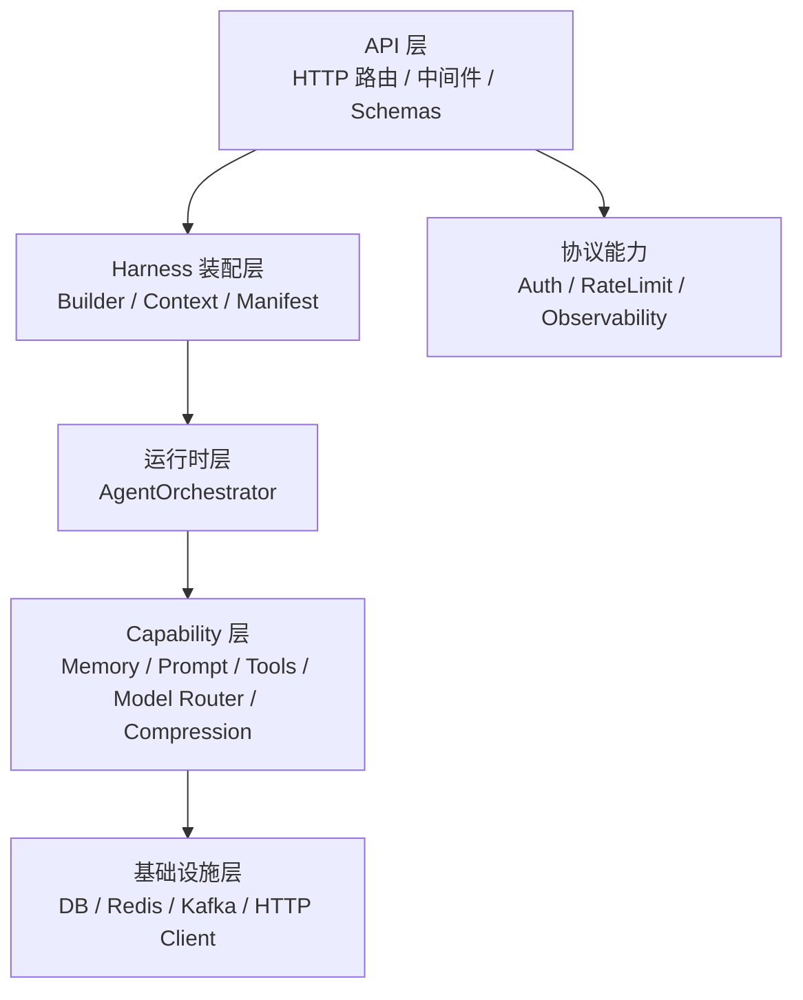
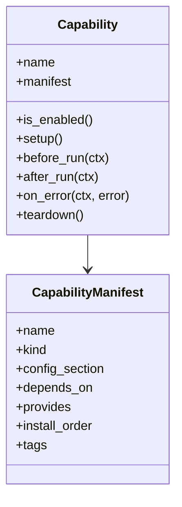
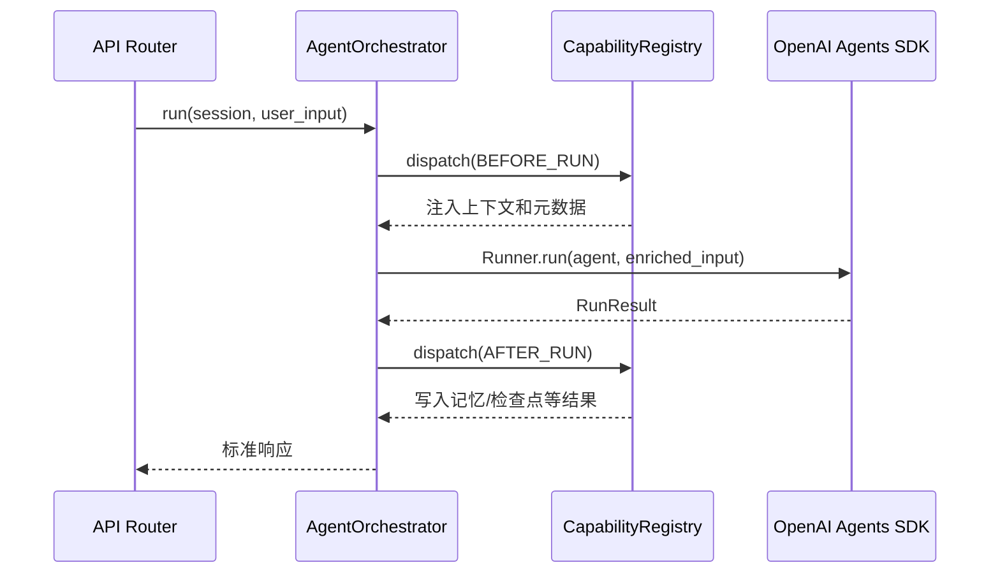
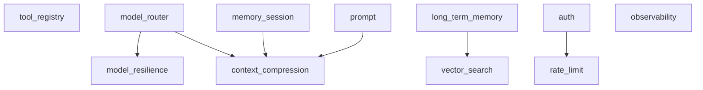
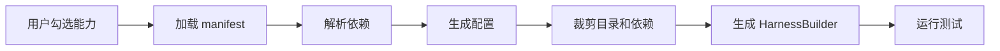

# 🏗️ Agent Harness 架构设计

本文档描述当前仓库的实际架构。目标不是描述一个理想蓝图，而是说明当前代码如何支持企业级 Agent Harness、可插拔能力和未来脚手架生成。

## 🎯 架构目标

Agent Harness 的目标是提供一个可复用的工程底座，让业务团队可以在平台勾选能力后生成可运行 Agent 工程。

核心目标：

- **可插拔**：能力可以按配置启用或关闭。
- **可裁剪**：脚手架生成时可以按能力组合裁剪目录、依赖和配置。
- **可维护**：`API`、`Runtime`、`Capability`、`Infrastructure` 边界清晰。
- **可观测**：请求、运行时、模型调用和工具调用具备追踪入口。
- **可测试**：能力抽象可被单元测试验证，完整链路可由集成测试覆盖。
- **贴合 OpenAI Agents SDK**：Runtime 主路径基于 `Agent`、`Runner`、`function_tool`。

## 🧭 分层设计



### API 层

位置：`src/api`

职责：

- 暴露 HTTP API。
- 从 FastAPI app state 获取 `Harness`。
- 不直接创建 `Runtime`，不直接判断能力组合。
- 安装协议层中间件，例如 Auth、RateLimit、Observability。

代表模块：

- `src/api/routers/chat.py`
- `src/api/routers/health.py`
- `src/api/routers/memory.py`
- `src/api/middleware/*`

### Harness 装配层

位置：`src/harness`

职责：

- 读取 settings。
- 构建 `ToolRegistry`、`ModelRouter`、`MemoryManager`、`PromptManager` 等资源。
- 注册基础 capability marker。
- 生成 `HarnessContext`。
- 管理能力资源生命周期。

代表模块：

- `src/harness/builder.py`
- `src/harness/context.py`
- `src/harness/manifest.py`
- `src/harness/config.py`

### 运行时层

位置：`src/application/orchestration`

职责：

- 选择模型。
- 构造 `RunContext`。
- 触发 capability 生命周期钩子。
- 调用 OpenAI Agents SDK `Runner.run()`。
- 返回统一结果。

`Runtime` 不负责直接创建具体资源，资源由 `HarnessBuilder` 注入。

### Capability 层

位置：`src/capabilities`

职责：

- 提供可插拔能力。
- 通过 `Capability` 协议接入运行生命周期。
- 通过 `CapabilityManifest` 暴露生成器可读的元信息。

当前能力包括：

- Tools
- Model Routing
- Memory
- Prompt
- Context Compression
- Observability
- Auth
- RateLimit
- HITL / Checkpoint / Handoff

### 基础设施层

位置：`src/infrastructure`

职责：

- 封装数据库、Redis、Kafka、HTTP Client 等基础设施。
- 不感知业务 Agent。
- 被 Harness 或 Capability 按需使用。

## 🧩 Capability 抽象

核心接口位于 `src/capabilities/plugin`。

能力通过两个维度描述：

1. **运行接口**：是否参与 `setup`、`before_run`、`after_run`、`on_error`、`teardown`。
2. **生成元数据**：能力名称、类型、依赖、产物、安装顺序。



示例：

```python
CapabilityManifest(
    name="prompt",
    kind=CapabilityKind.RUNTIME,
    config_section="prompt",
    provides=("prompt_manager", "prompt_rendering"),
    install_order=10,
)
```

## 🔄 运行时执行流程



## 🧬 能力依赖图



说明：

- `model_router` 是模型选择和弹性运行的基础。
- `memory_session` 提供对话上下文，`context_compression` 在其后运行。
- `prompt` 可以为主 Agent 和摘要策略提供模板，但关闭时使用内置兜底文本。
- `auth` 和 `rate_limit` 属于协议层能力，不进入 Agent `RunContext` 主链路。
- `observability` 同时管理中间件和 Langfuse/OpenTelemetry 生命周期。

## 🧱 HarnessBuilder 装配策略

`HarnessBuilder` 是当前架构中最关键的组合点。

它负责：

- 创建 `ToolRegistry` 并注册默认工具。
- 创建 `ModelRouter` 和模型弹性配置。
- 创建 `MemoryStore`。
- 按需创建 `MemoryManager`。
- 按需创建 `PromptManager`。
- 注册 capability marker。
- 创建 `AgentOrchestrator` 并注入依赖。
- 校验能力依赖。

这种方式让 `Runtime` 不再依赖全局单例，也让脚手架生成器可以围绕 `Builder` 做模板裁剪。

## 🧰 OpenAI Agents SDK 适配

当前主路径：

- 工具通过 `ToolRegistry.list_agent_tools()` 转为 SDK 可消费工具。
- `Runtime` 创建 `Agent`。
- `Runtime` 使用 `OpenAIChatCompletionsModel` 注入模型。
- `Runtime` 通过 `Runner.run()` 执行。
- 模型降级、重试、超时由 `ModelRouter.run_with_resilience()` 包裹。

原则：

- 不重新实现 Agent 执行引擎。
- Harness 只负责企业工程能力和上下文装配。
- SDK 的 Agent、Runner、Tool 仍是核心抽象。

## 🏭 脚手架生成适配

脚手架生成器可以读取 `CapabilityManifest` 完成以下工作：

| 生成步骤 | 使用字段 |
| --- | --- |
| 能力选择 | `name` |
| 能力分类 | `kind` |
| 配置生成 | `config_section` |
| 依赖校验 | `depends_on` / `provides` |
| 注册顺序 | `install_order` |
| 模板标签 | `tags` |

推荐生成流程：



## ✅ 当前已解决的问题

- `Runtime` 不再在 API 路由中全局实例化。
- Memory、Prompt、Observability 已迁移到 Harness 或插件装配。
- Capability graph 已可通过 `/health/capabilities` 查看。
- 测试已拆分为 `unit`、`integration`、`e2e`。
- README 和文档索引已按当前实现更新。

## ⚠️ 后续演进重点

- 将 `vector_search` 从 marker 推进到完整资源实现。
- 将 HITL 对齐 OpenAI Agents SDK 原生中断/恢复机制。
- 增加 scaffold generator 原型。
- 输出能力依赖矩阵和模板裁剪规则。
- 继续清理历史方案文档中与当前实现不一致的表述。
