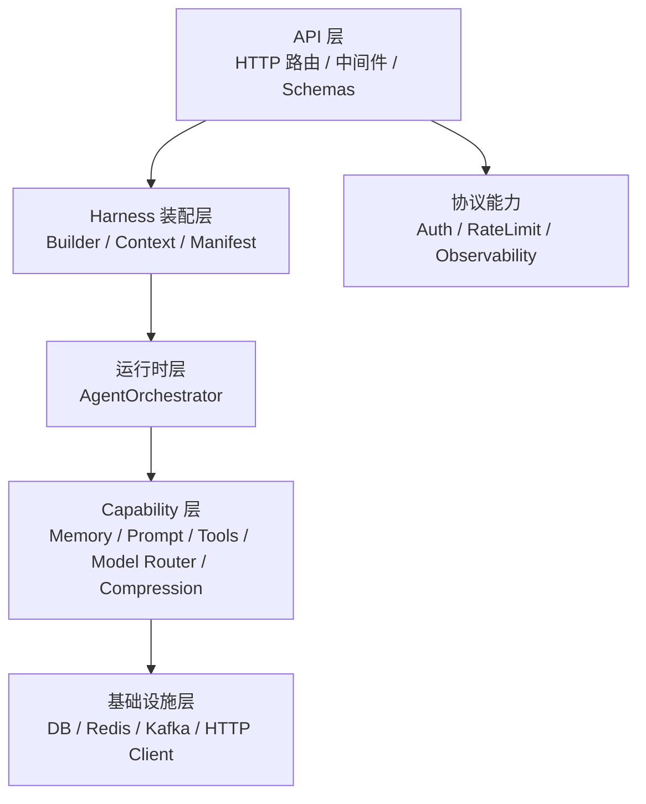
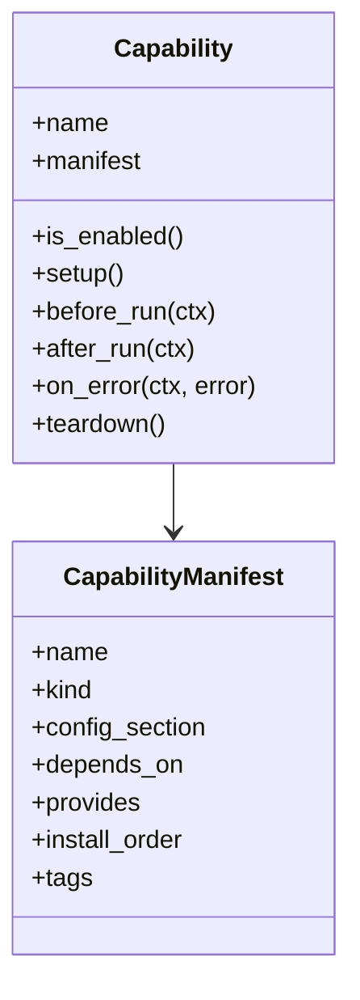
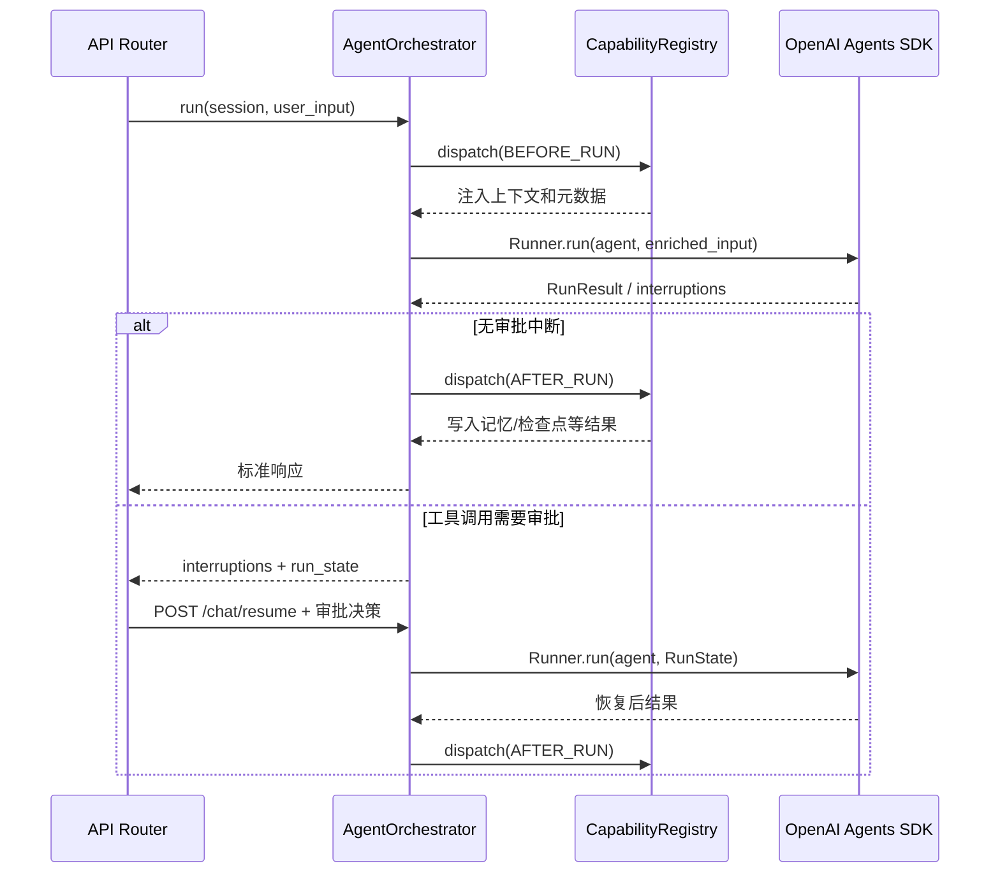
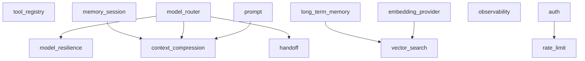
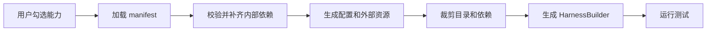

# 🏗️ Agent Harness 架构设计

本文档描述当前仓库的实际架构。目标不是描述一个理想蓝图，而是说明当前代码如何支持企业级 Agent Harness、可插拔能力和未来脚手架生成。

> 状态：当前实现基准文档。架构判断与脚手架设计应优先以本文和代码为准。

## 🎯 架构目标

Agent Harness 的目标是提供一个可复用的工程底座，让业务团队可以在平台勾选能力后生成可运行 Agent 工程。

核心目标：

- **可插拔**：能力可以按配置启用或关闭。
- **可裁剪**：脚手架生成时可以按能力组合裁剪目录、依赖和配置。
- **可维护**：`API`、`Runtime`、`Capability`、`Infrastructure` 边界清晰。
- **可观测**：请求、运行时、模型调用和工具调用具备追踪入口。
- **可测试**：能力抽象可被单元测试验证，完整链路可由集成测试覆盖。
- **贴合 OpenAI Agents SDK**：Runtime 主路径基于 `Agent`、`Runner`、`function_tool`。

## 🧭 分层设计



### API 层

位置：`src/api`

职责：

- 暴露 HTTP API。
- 从 FastAPI app state 获取 `Harness`。
- 不直接创建 `Runtime`，不直接判断能力组合。
- 安装协议层中间件，例如 Auth、RateLimit、Observability。

代表模块：

- `src/api/routers/chat.py`
- `src/api/routers/health.py`
- `src/api/routers/memory.py`
- `src/api/middleware/*`

### Harness 装配层

位置：`src/harness`

职责：

- 读取 settings。
- 构建 `ToolRegistry`、`ModelRouter`、`MemoryManager`、`PromptManager` 等资源。
- 注册基础 capability marker。
- 生成 `HarnessContext`。
- 管理能力资源生命周期。

代表模块：

- `src/harness/builder.py`
- `src/harness/context.py`
- `src/harness/manifest.py`
- `src/harness/config.py`

### 运行时层

位置：`src/application/orchestration`

职责：

- 选择模型。
- 构造 `RunContext`。
- 触发 capability 生命周期钩子。
- 调用 OpenAI Agents SDK `Runner.run()`。
- 返回统一结果。

`Runtime` 不负责直接创建具体资源，资源由 `HarnessBuilder` 注入。

### Capability 层

位置：`src/capabilities`

职责：

- 提供可插拔能力。
- 通过 `Capability` 协议接入运行生命周期。
- 通过 `CapabilityManifest` 暴露生成器可读的元信息。

当前能力包括：

- Tools
- Model Routing
- Memory
- Prompt
- Context Compression
- Observability
- Auth
- RateLimit
- HITL / Checkpoint / Handoff

### 基础设施层

位置：`src/infrastructure`

职责：

- 封装数据库、Redis、Kafka、HTTP Client 等基础设施。
- 不感知业务 Agent。
- 被 Harness 或 Capability 按需使用。

## 🧩 Capability 抽象

核心接口位于 `src/capabilities/plugin`。

能力通过两个维度描述：

1. **运行接口**：是否参与 `setup`、`before_run`、`after_run`、`on_error`、`teardown`。
2. **生成元数据**：能力名称、类型、依赖、产物、安装顺序。



示例：

```python
CapabilityManifest(
    name="prompt",
    kind=CapabilityKind.RUNTIME,
    config_section="prompt",
    provides=("prompt_manager", "prompt_rendering"),
    install_order=10,
)
```

## 🔄 运行时执行流程



## 🧬 能力依赖图



说明：

- `model_router` 是模型选择和弹性运行的基础。
- `memory_session` 提供对话上下文，`context_compression` 在其后运行。
- `prompt` 可以为主 Agent 和摘要策略提供模板，但关闭时使用内置兜底文本。
- `auth` 和 `rate_limit` 属于协议层能力，不进入 Agent `RunContext` 主链路。
- `observability` 同时管理中间件和 Langfuse/OpenTelemetry 生命周期。

## 🧱 HarnessBuilder 装配策略

`HarnessBuilder` 是当前架构中最关键的组合点。

它负责：

- 创建 `ToolRegistry` 并注册默认工具。
- 读取 HITL 配置并将待审批工具映射为 SDK 原生审批工具。
- 读取 Checkpoint 配置并按需注册进程内执行快照能力。
- 读取 Handoff 专家配置并将目标 Agent 挂载到 SDK 主 Agent。
- 创建 `ModelRouter` 和模型弹性配置。
- 创建 `MemoryStore`。
- 按需创建 `MemoryManager`。
- 按需创建 `PromptManager`。
- 注册 capability marker。
- 创建 `AgentOrchestrator` 并注入依赖。
- 校验能力依赖。

这种方式让 `Runtime` 不再依赖全局单例，也让脚手架生成器可以围绕 `Builder` 做模板裁剪。

## 🧰 OpenAI Agents SDK 适配

当前主路径：

- 工具通过 `ToolRegistry.list_agent_tools()` 转为 SDK 可消费工具。
- 标记为需要审批的工具映射为 SDK `needs_approval=True` 工具。
- `Runtime` 创建 `Agent`。
- `Runtime` 使用 `OpenAIChatCompletionsModel` 注入模型。
- `Runtime` 通过 `Runner.run()` 执行。
- SDK 返回 `interruptions` 时，`Runtime` 返回序列化 `RunState`，由 `POST /chat/resume` 接收人工决策。
- 恢复请求通过 `RunState.approve()` / `RunState.reject()` 处理决策，再将状态交还 `Runner.run()`。
- 启用 handoff 时，Runtime 将配置生成的专家 Agent 交给 SDK 原生 `Agent.handoffs` 执行转交。
- 模型降级、重试、超时由 `ModelRouter.run_with_resilience()` 包裹。

原则：

- 不重新实现 Agent 执行引擎。
- Harness 只负责企业工程能力和上下文装配。
- SDK 的 Agent、Runner、Tool 仍是核心抽象。

当前 HTTP 恢复接口采用轻量无状态方式：调用方暂存中断响应里的 `run_state` 并在审批时回传。生产化阶段应将运行状态和审批记录迁移到服务端存储，并补充查询、审计和幂等控制。

当 `HITL_ENABLED=true` 时，`HarnessBuilder` 会装配 `ApprovalManager`，并将 `HITL_REQUIRE_APPROVAL_TOOLS` 列出的工具策略注入 `ToolRegistry`。恢复请求必须回传中断响应中的原始输入、实际模型和运行状态，以保持能力生命周期和 fallback 模型一致；此模式下还必须携带审批请求标识，Runtime 会校验审批请求、会话、中断序号和运行状态的一致性，再将决定应用到 SDK `RunState`。

`Checkpoint` 与 HITL 状态存储保持分离。当前 `CHECKPOINT_ENABLED=true` 只装配进程内 `CheckpointManager`；`CHECKPOINT_AUTO_SAVE=true` 时记录运行前/后的 `AgentState` 摘要。该能力用于运行回看与业务状态检查，不包含 SDK 序列化 `RunState`，因此不能替代 HITL 的持久化状态仓库。

当 `HANDOFF_ENABLED=true` 时，`HANDOFF_AGENTS_JSON` 描述静态专家 Agent 的名称、描述与指令。`HarnessBuilder` 装配 `HandoffManager`，Runtime 使用与主 Agent 相同的当前模型构造专家目标并传入 SDK 原生 `handoffs`。本阶段不扩展专家专属工具和动态路由，以保持配置契约轻量。

## 🏭 脚手架生成适配

脚手架生成器可以读取 `CapabilityManifest` 完成以下工作：

| 生成步骤 | 使用字段 |
| --- | --- |
| 能力选择 | `name` |
| 能力分类 | `kind` |
| 配置生成 | `config_section` |
| 依赖校验 | `depends_on` / `provides` |
| 注册顺序 | `install_order` |
| 模板标签 | `tags` |

当前工程同时通过 `/health/capability-catalog` 输出机器可读目录。它与 `/health/capabilities` 的区别是：

| 接口 | 用途 |
| --- | --- |
| `/health/capabilities` | 查看当前运行实例实际装配的能力图 |
| `/health/capability-catalog` | 查看平台可选择的能力目录、当前选择状态与依赖矩阵 |
| `/health/capability-selection/validate` | 校验候选组合、补齐内部依赖、列出外部资源要求 |

目录中的 `provider_capabilities` 用于解析能力间依赖；`external_resource=true` 表示平台还需校验数据库等外部资源配置。

`memory_manager` 与 `tool_registry` 在目录中标记为 `builder_resource`，由生成后的 `HarnessBuilder` 装配，不作为平台 UI 的独立勾选项。`memory_session` 与 `model_router` 标记为基础能力，会在选择校验时自动进入 `resolved_selection`。

选择校验接口保持为纯元数据计算：它不会修改当前运行实例，不创建数据库连接，也不生成目录。对于 `{"selected":["vector_search"]}`，接口会返回自动补齐的 `long_term_memory`、`memory_manager`、`embedding_provider` 与基础能力，并将 `database`、`embedding_api` 列为外部资源要求。

推荐生成流程：



## ✅ 当前已解决的问题

- `Runtime` 不再在 API 路由中全局实例化。
- Memory、Prompt、Observability 已迁移到 Harness 或插件装配。
- 当前装配能力图已可通过 `/health/capabilities` 查看。
- 可选择能力目录和依赖矩阵已可通过 `/health/capability-catalog` 读取。
- 候选能力组合已可通过 `/health/capability-selection/validate` 做生成前校验。
- Memory 长期关系存储支持 MySQL / PostgreSQL；`EmbeddingProvider` 接入写入与检索链路；向量后端可配置为 Elasticsearch 或 PostgreSQL pgvector。
- 测试已拆分为 `unit`、`integration`、`e2e`。
- README 和文档索引已按当前实现更新。

## ⚠️ 后续演进重点

- 为 `EmbeddingProvider` 增加批量化、成本观测与替代供应商适配，并验证 ES / pgvector 的生产索引参数。
- 为 HITL 增加服务端状态持久化、审批查询、审计和幂等控制。
- 在能力选择校验结果上补充模板裁剪规则和配置字段生成映射。
- 建立最小工程生成原型，验证能力裁剪后的导入路径和测试集合。
- 继续清理历史方案文档中与当前实现不一致的表述。
