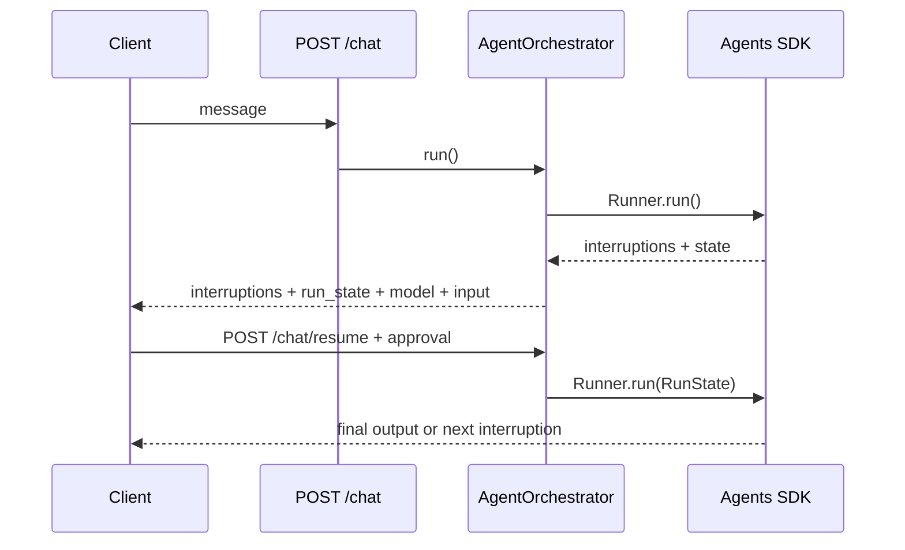

# AgentOrchestrator 使用指南

> 状态：当前实现指南。HTTP 应用推荐由 `src.api.app.create_app()` 和 `HarnessBuilder` 装配，不要在路由模块创建 runtime 单例。

## 职责边界

`AgentOrchestrator` 是一次 Agent 运行的应用层协调器：

1. 使用 `ModelRouter` 选取模型并套用可选弹性策略。
2. 创建 `RunContext`，调用 `CapabilityRegistry` 的运行期 hook。
3. 使用 OpenAI Agents SDK `Agent` 与 `Runner.run()` 执行。
4. 处理 SDK 原生 `interruptions` / `RunState` 审批恢复与 `Agent.handoffs`。
5. 返回统一结果。

资源创建与生命周期属于 `HarnessBuilder`；HTTP middleware 属于 `ProtocolPluginRegistry`。

## 推荐装配

服务入口已完成装配：

```python
from src.api.app import create_app
from src.core.config import current_settings

app = create_app(current_settings)
```

在测试或嵌入式调用中，可直接构建 harness：

```python
from src.application.orchestration.agent_runtime import AgentSession
from src.core.config import current_settings
from src.harness.builder import build_harness

harness = build_harness(current_settings)
await harness.setup()
try:
    result = await harness.runtime.run(
        AgentSession(session_id="session-001", user_id="user-001"),
        "请查询北京天气。",
    )
finally:
    await harness.teardown()
```

## 基础能力

默认装配包含：

| 能力 | 行为 |
| --- | --- |
| `tool_registry` | 注册 `get_weather` 与 `add_numbers` SDK 工具 |
| `model_router` | 选择默认模型或 reasoning 模型 |
| `memory_session` | 使用进程内 `MemoryStore` 注入本会话历史 |

`MemoryStore` 是基础会话上下文，不提供跨进程耐久性。

## 可选 Runtime 能力

| 配置 | 行为 | 当前边界 |
| --- | --- | --- |
| `MEMORY_ENABLED=true` | 有 `DATABASE_URL` 时装配 `MemoryManager` | 关系长期记录与基础 memory 写入绑定 |
| `MEMORY_LONG_TERM_ENABLED=true` | 配合 vector/embedding 配置启用语义检索 | 需额外后端与 embedding API |
| `PROMPT_ENABLED=true` | 构建 `PromptManager`，主 Agent/摘要策略按需读取模板 | 读取失败可按配置回退 |
| `COMPRESSION_ENABLED=true` | 在模型调用前压缩注入后的上下文 | 默认 fail-open |
| `HITL_ENABLED=true` | 将指定工具映射为 SDK `needs_approval` | 审批存储当前为进程内 |
| `CHECKPOINT_ENABLED=true` | 记录运行前/后 `AgentState` 摘要 | 不是 SDK 状态恢复仓库 |
| `HANDOFF_ENABLED=true` | 从 JSON 配置创建 SDK handoff 目标 | 仅静态目标/共享模型 |

## HITL 流程



启用 HITL 后，恢复请求必须携带响应中的 `approval_request_id`、`run_state`、原始 `message`、实际 `model` 与中断序号。

## 直接构造 Runtime

只有组件测试或自定义宿主才建议直接构造：

```python
from src.application.orchestration.agent_runtime import AgentOrchestrator, AgentSession
from src.capabilities.memory.store import MemoryStore
from src.capabilities.model_routing.router import ModelRouter
from src.capabilities.tools.registry import ToolRegistry

tools = ToolRegistry()
tools.register_defaults()
runtime = AgentOrchestrator(
    tool_registry=tools,
    memory_store=MemoryStore(),
    model_router=ModelRouter(),
)
result = await runtime.run(AgentSession(session_id="s1"), "hello")
```

涉及数据库、Prompt、HITL、Checkpoint 或 Handoff 时，使用 `HarnessBuilder` 可避免遗漏资源初始化和能力开关映射。

## 能力图

以下接口可查看实际装配结果或校验拟生成组合：

```bash
curl http://localhost:8080/health/capabilities
curl http://localhost:8080/health/capability-catalog
curl -X POST http://localhost:8080/health/capability-selection/validate \
  -H 'Content-Type: application/json' \
  -d '{"selected":["handoff","vector_search"]}'
```

## 已知限制

- Capability manifest 提供目录与依赖信息；部分具体能力仍在 Runtime 中注册和调用，并非完全由 manifest 动态驱动。
- HITL 与 Checkpoint 当前未提供服务端耐久恢复、审批审计与幂等控制。
- Session/memory 的资源归属授权仍需在生产接入前补齐。

## 相关文件

- [架构设计](../architecture/ARCHITECTURE_DESIGN.md)
- [高级 Agent 能力](./ADVANCED_AGENTS_GUIDE.md)
- [Memory 系统](./MEMORY_SYSTEM.md)
- `src/harness/builder.py`
- `src/application/orchestration/agent_runtime.py`
