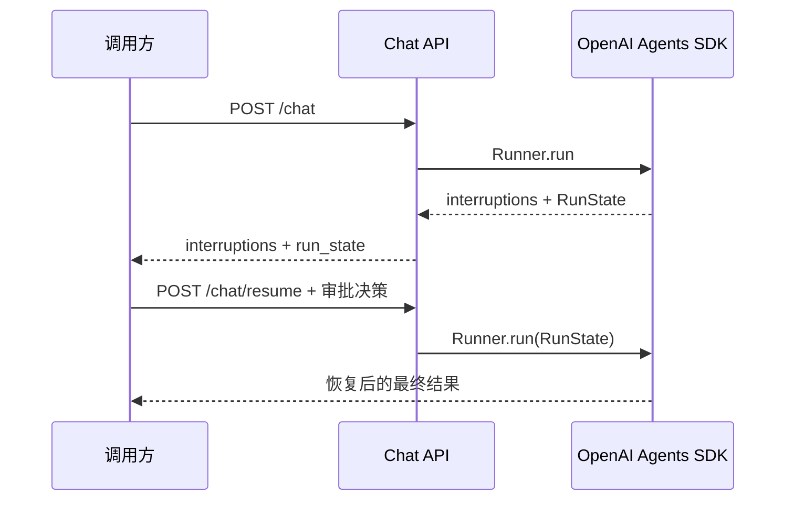

# 🚀 示例索引

`examples/` 用于说明业务工程如何消费 Harness 能力，不承担测试职责。可重复验证的行为以 `tests/` 为准。

## 示例列表

| 示例 | 定位 | 运行条件 |
| --- | --- | --- |
| [`scaffold_selection.py`](./scaffold_selection.py) | 候选能力组合与外部依赖解析 | 本地可直接运行 |
| [`hitl_resume.py`](./hitl_resume.py) | SDK 原生工具审批的 HTTP 中断/恢复主路径 | 需要运行中的 Harness 与模型服务 |
| [`handoff.py`](./handoff.py) | 配置驱动的 SDK 原生 Handoff 目标装配 | 本地可直接运行 |
| [`advanced_agents_components.py`](./advanced_agents_components.py) | HITL、Checkpoint、Handoff 底层 manager 组件演示 | 本地可直接运行 |
| [`model_resilience.py`](./model_resilience.py) | Model Router 的 fallback、retry、timeout 集成示例 | 需要模型服务与 API Key |
| [`observability.py`](./observability.py) | OpenAI Agents SDK Trace 与自定义观测示例 | 需要模型服务；远端追踪需要 Langfuse |

## 🧩 推荐的高级能力接入路径

`advanced_agents_components.py` 适合理解和调试内部 manager，但不是 HTTP 应用的主接入路径。

当前 Harness 中推荐的 HITL 流程为：



Handoff 由 `HANDOFF_ENABLED` 与 `HANDOFF_AGENTS_JSON` 配置驱动，Runtime 将目标 Agent 传入 SDK 原生 `Agent.handoffs`。

详细说明参见：

- [项目 README](../README.md)
- [架构设计](../docs/architecture/ARCHITECTURE_DESIGN.md)
- [高级能力指南](../docs/guides/ADVANCED_AGENTS_GUIDE.md)

## ▶️ 本地可运行示例

```bash
venv/bin/python examples/scaffold_selection.py vector_search hitl
venv/bin/python examples/handoff.py
venv/bin/python examples/advanced_agents_components.py
```

## 🔁 HITL 中断恢复示例

先在运行配置中启用待审批工具并启动服务：

```bash
HITL_ENABLED=true
HITL_REQUIRE_APPROVAL_TOOLS=get_weather
make run
```

在另一个终端发起会触发该工具的请求，并批准中断：

```bash
venv/bin/python examples/hitl_resume.py --approve --message "请查询北京天气。"
```

示例会先请求 `POST /chat`，读取返回的 `interruptions` 与 `run_state`，再将审批决定提交至 `POST /chat/resume`。若模型没有触发待审批工具，脚本将打印本次的普通完成响应。

涉及模型或 Langfuse 的示例应先按 [快速入门](../docs/getting-started/QUICKSTART.md) 配置环境变量。
